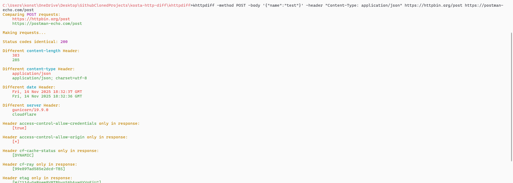

## Demo




# khttpdiff

Compare HTTP responses from two servers and visualize the differences. Ideal for testing API migrations, load balancer configurations, and server deployments.

## Table of Contents

1. [Overview](#overview)
2. [Features](#features)
3. [Installation](#installation)
4. [Usage](#usage)
5. [Examples](#examples)
6. [Configuration](#configuration)
7. [Contributing](#contributing)
8. [License](#license)

## Overview

`khttpdiff` performs identical HTTP requests against two different servers and presents a detailed comparison of their responses. The tool presents differences in status codes, headers, and response bodies with color-coded output. For optimal visualization, use a terminal that supports ANSI escape sequences.

## Features

Configure requests with custom methods, headers, and request bodies. Output differences are color-coded for easy identification, or use monochrome mode for unsupported terminals. Integrate external diff tools for detailed body comparison. The tool supports both secure and insecure SSL connections.

## Installation

### Pre-built Binary

Download the [khttpdiff.zip](https://limewire.com/d/3zT45#zhFnxk4EL9) folder containing the khttpdiff.exe executable. No Java installation required.

### Adding to PATH (Windows)

1. Copy the khttpdiff folder to a permanent location (e.g., `C:\Program Files\khttpdiff`)
2. Open System Properties (`Win + Pause/Break` or `right-click` `This PC > Properties`)
3. Click `Advanced system settings`
4. Click `Environment Variables`
5. Under `System variables`, find and select `Path`, then click `Edit`
6. Click `New` and add the full path to the `khttpdiff` folder
7. Click `OK` to save changes
8. Restart your terminal


### Basic syntax:

```
khttpdiff [options] url1 url2
```


### Available Options

```
method <method> : HTTP method to use (default: GET)
body <data> : Request body for POST/PUT requests
host <host> : Custom Host header value
agent <ua> : User-Agent string (default: khttpdiff/0.1)
ignore <headers> : Comma-separated list of headers to exclude from comparison
header <hdr> : Single custom header in "Key: Value" format
headers <file> : File containing custom headers (one per line)
insecure : Allow insecure SSL connections (skip certificate validation)
diffapp <app> : External diff tool for body comparison
mono : Disable color output
help : Display help information
```

## Examples

### Basic GET Request Comparison

```
khttpdiff https://httpbin.org/get https://httpbin.org/uuid
```

### POST Request with Custom Headers

```
khttpdiff -method POST -body '{"name":"test"}' -header "Content-Type: application/json" https://httpbin.org/post https://postman-echo.com/post
```

### Ignore Specific Headers

```
khttpdiff -ignore Date,Server https://jsonplaceholder.typicode.com/posts/1 https://jsonplaceholder.typicode.com/posts/2
```

### Using External Diff Tool

```
khttpdiff -diffapp fc https://dummyjson.com/products/1 https://dummyjson.com/products/2
```

### Headers from File

Create a headers.txt file:

```
Authorization: Bearer token123
Content-Type: application/json
X-Custom-Header: value
```

Then run:

```
khttpdiff -headers headers.txt -method POST -body '{"test":true}' https://httpbin.org/post https://postman-echo.com/post
```

### Insecure SSL Connection

```
khttpdiff -insecure https://self-signed.badssl.com https://httpbin.org/get
```

## Configuration

### Header Files Format

Headers files should contain one header per line in "Key: Value" format. Lines starting with "//" are treated as comments and ignored. Empty lines are also ignored.

Example:

```
// Authentication headers
Authorization: Bearer token123
// Content headers
Content-Type: application/json
Accept: application/json
```

## Contributing

Contributions are welcome. Please read the [CONTRIBUTING.md](CONTRIBUTING.md) file for guidelines on how to submit issues, feature requests, and pull requests.

## License

This project is licensed under the MIT License. See the [LICENSE](LICENSE) file for details.

## Acknowledgments

Inspired by [httpdiff](https://github.com/jgrahamc/httpdiff) by John Graham-Cumming.